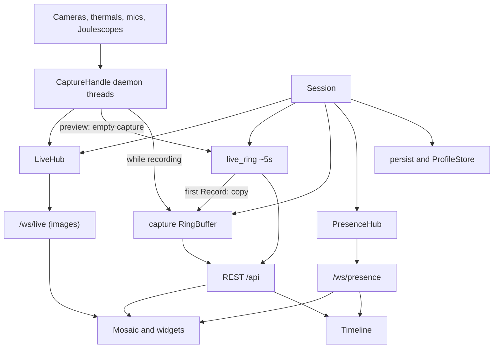

# measync architecture

This document is the source of truth for how measync is shaped. New code must fit these boundaries, invariants, and widget families. If a change would violate them, update this document in the same change.

measync (“measure · align · rewind”) is a lab workbench: tiled live sources, a short live RAM buffer, a shared capture ring, and a timeline every viewer can scrub independently.

## Purpose

One backend process owns hardware and the capture buffer. Connected browsers are viewers of that single session: they share layout and recording state, but each has its own timeline window.

The product is not a general video editor, a multi-room service, or a per-user store. There is one session, one time base, and no authentication.

## Features

- **Tiled mosaic** — binary-split layout; split, swap, dock, and resize panes. Layout is shared with every connected viewer.
- **Live sources** — cameras, Infiray thermal cameras (hybrid feed + graph), microphones, and Joulescopes today; other real-time and graph sources later.
- **Live preview** — WebSocket fan-out of the latest **image** per camera/thermal source. Graph tiles query the selected time window over HTTP.
- **Preview / Record / Stop / Reset** — adding a source fills a ~5 s `live_ring`. Record copies that preview into the capture ring (or resumes a frozen take), then appends until Stop. Stop fully stops ring appends. Reset clears RAM and returns to the 5 s preview (confirm if `dirty`). After Stop, each viewer can **Play / Pause** a frozen take at a chosen speed (viewer-local playhead). Those controls are disabled during preview and recording.
- **Time-aligned eviction** — when the byte cap is exceeded, the oldest horizon is dropped from every track together.
- **Independent timeline** — lock front (newest samples) and lock back (oldest samples) default both on (full interval). Scroll to zoom, drag to pan/scrub. The same window is shared by the timeline and every graph tile.
- **Captures** — save the ring to `data/captures/` or open a previous take back into RAM.
- **Profiles** — save/load this workspace’s tile layout and sources to `data/profiles/`.
- **Presence** — display names, colors, viewport markers on the shared timeline; click a name to jump to that window.

Unsaved RAM captures are discarded when you Reset (after confirm) or stop the backend. Record from preview keeps the ~5 s you were just watching as the start of the take. Record after Stop resumes the same take.

## Widget families

Tiles are not camera/audio-specific. Every widget is built from two playback models. Most tiles use exactly one; **hybrid** tiles compose both in one pane. Do not invent a third scrub model. Lock front / lock back are **viewport policy** in [`viewport.ts`](../frontend/src/viewport.ts): they choose the window centre and duration, not a separate widget query type. Replay of a frozen take is the same selected timestamp, advanced locally by Play/Pause.

### Real-time

Discrete snapshots along the timeline. Examples: cameras today; text logs later.

| Mode | Behavior |
|------|----------|
| Live | Stream the latest snapshot (`/ws/live/{source_id}`). Unplug clears the tile (black + `OFFLINE`); replug resumes. |
| Scrub | Show the **closest snapshot** to the selected timestamp (timeline window centre). |

Current implementation: [`frontend/src/widgets/CameraWidget.tsx`](../frontend/src/widgets/CameraWidget.tsx) with `GET /api/session/camera/{id}/frame?t=`.

### Graph

Continuous series over a window. Examples: audio amplitude, Joulescope voltage/current/power.

Every graph is **1..N scalar lines**. Each viewer picks a plot budget (`GRAPH_POINTS`, default **100**, query `max_points`, clamped 16–2000). That is a local display preference, not session/layout state. If the visible window has at most that many samples, the widget plots those samples at their real timestamps with a **dot** on each point (`raw: true`). If there are more, every graph-style widget uses the same **ingest-time bins** (`BIN_NS` = 50 ms, `t // BIN_NS`): audio, Joulescope, and thermal fill a fixed absolute grid as samples arrive. Sealed bins never change their sample set; only the open newest bin updates. A condensed query slices those bins (`raw: false`) and folds them to `max_points` if needed (mean stroke; min/max band when `count > 1`). Dots are not drawn on the bucketed path. Thermal zone traces are sampled from frames (zone geometry is tile-local) and projected onto that same ingest grid so they share timestamps with min/max/center. Range queries include USB chunks that overlap the window when returning raw samples (chunk stamps are the last sample). Thermal min and max stay **separate lines**. Audio is one amplitude line. Joulescope is three lines (U, I, P) in stacked panes with independent Y-axes. Each pane autoscales Y; the scale holds while you pan at the same zoom so a near-DC channel (voltage) does not thrash. Graphs draw time ticks from the capture origin (same zero as the timeline). Axis ticks and playhead readouts use SI prefixes (mA, kV, µW) or scientific notation when a prefix does not fit. While the red playhead is visible (not both locks), each line prints its value at that time. Live graph HTTP pumps wait ~200 ms between fetches.

| Mode | Behavior |
|------|----------|
| Growing buffer (preview or recording) | Query the **currently selected window** (`t0`–`t1`) from the live ring (or the capture ring while recording). Lock front pins the right edge at `t_max`; lock back pins the left edge at `t_min`; both locks fit the full interval. |
| Scrub | Same range query, centered on the selected timestamp. |

Current implementation: [`frontend/src/widgets/GraphPlot.tsx`](../frontend/src/widgets/GraphPlot.tsx) plus [`AudioWidget.tsx`](../frontend/src/widgets/AudioWidget.tsx) (`GET /api/session/audio/{id}/waveform?t0=&t1=&max_points=`), [`JoulescopeWidget.tsx`](../frontend/src/widgets/JoulescopeWidget.tsx) (`GET /api/session/joulescope/{id}/series?t0=&t1=&max_points=`). Ingest-time bins live in [`backend/measync/graph.py`](../backend/measync/graph.py) (`IngestBins`) and are filled from each graph track’s append.

### Hybrid

One tile, two queries: a real-time snapshot on top and a graph of the selected window below. Infiray thermals are the first hybrid widget.

| Pane | Behavior |
|------|----------|
| Upper (image) | Same as real-time: live `/ws/live` (including while a capture exists) or closest snapshot `GET /api/session/thermal/{id}/frame?t=`. |
| Lower (graph) | Same as graph: `GET /api/session/thermal/{id}/series?t0=&t1=` for the selected window, using the same ingest-time bins as other graph tiles. Optional `zones=x,y,w,h;…` (sensor pixels) adds per-zone min/max series projected onto that grid. |

Users drag rectangles on the feed to mark zones. Each zone shows local min/max on the image; the graph plots those traces next to global min / max / center, with legend labels. Zone geometry lives on the tile spec (presence/layout), not in the ring.

Current implementation: [`frontend/src/widgets/ThermalWidget.tsx`](../frontend/src/widgets/ThermalWidget.tsx). Live `/ws/live` payload is a `THRM` snapshot: header, colormap JPEG, and a zlib temperature map used for zone stats.

Live **image** preview uses `/ws/live` when the buffer is growing and lock front is on (including both locks), even if a capture exists under the playhead — otherwise the last ring JPEG would freeze on unplug. Graph widgets always render the selected `[t0, t1]` window via HTTP. `/ws/live` is image-only for tiles; capture threads still publish audio/Joulescope JSON for the hub, but graph widgets do not plot from it.

## Runtime topology

```
Browser (Vite :5173)
  /api  ──proxy──► FastAPI (uvicorn :8000)
  /ws   ──proxy──► FastAPI WebSockets
                     │
                     ▼
              data/captures/
              data/profiles/
```

- Backend: Python 3.11+, FastAPI, one global `Session` created in app lifespan.
- Frontend: React 19, TypeScript, Vite 8. Dev server proxies `/api` and `/ws` to `127.0.0.1:8000`.
- Capture is Linux-centric: V4L2 cameras (`/dev/video*`), Infiray-family thermal UVC (256×384 YUYV), PortAudio mics, and USB Joulescopes (`joulescope` package).
- Persistence lives under repo-root `data/` (gitignored). Path is `backend/measync/main.py` → two parents up → `data/`.

There is no production static serving, TLS, Docker, or multi-process session.

## Components



| Piece | Role |
|-------|------|
| [`backend/measync/main.py`](../backend/measync/main.py) | FastAPI app, CORS, all HTTP and WebSocket routes. No capture or ring logic. |
| [`backend/measync/session.py`](../backend/measync/session.py) | Orchestrator: recording flag, `dirty`, source handles, capture `ring` and preview `live_ring`, data dirs. `query_ring` returns the capture ring whenever a take exists. |
| [`backend/measync/capture.py`](../backend/measync/capture.py) | Per-source daemon thread. Publishes live while the device is open; on drop, publishes `{type: "offline"}`, releases, and retries until the device returns. `Session.store_*` appends to `live_ring` only in preview (empty capture, not recording) and to the capture ring only while `recording`. Stop writes nowhere. Joulescope sample-rate and current-port (`i_range`) changes are applied on this thread, not from USB callbacks. |
| [`backend/measync/ring.py`](../backend/measync/ring.py) | `CamTrack` / `AudioTrack` / `JoulescopeTrack` / `RingBuffer`. Thread-locked; global time-aligned eviction (raw chunks and ingest bins share the horizon). Optional `keep_ns` trims to a trailing time window (live ring). `CamTrack` holds camera JPEGs and thermal `THRM` snapshots (`kind` on the track); thermal tracks also fill 50 ms ingest bins for min/max/center. `JoulescopeTrack` stores chunked U/I/P samples plus the same ingest bins. |
| [`backend/measync/livehub.py`](../backend/measync/livehub.py) | Thread → asyncio fan-out. Per-source queues (`maxsize` 2); drop oldest on overflow. `{type: "offline"}` is fanned out and is **not** kept as `latest`. |
| [`backend/measync/presence.py`](../backend/measync/presence.py) | Peers, viewport broadcast, shared layout (last writer wins). |
| [`backend/measync/devices.py`](../backend/measync/devices.py) | Enumerate cameras, Infiray thermals, mics, and Joulescopes. |
| [`backend/measync/thermal.py`](../backend/measync/thermal.py) | Infiray P2 Pro decode, colormap JPEG, snapshot packing, zone extrema, series points. |
| [`backend/measync/joulescope.py`](../backend/measync/joulescope.py) | Scan, serial match, supported output rates, current-port apply. |
| [`backend/measync/graph.py`](../backend/measync/graph.py) | `IngestBins` is the common graph downsample path (50 ms grid; audio, Joulescope, thermal). Viewer budget `GRAPH_POINTS` (100); APIs accept `max_points`. |
| [`backend/measync/persist.py`](../backend/measync/persist.py) | Capture save/load under `data/captures/`. |
| [`backend/measync/profiles.py`](../backend/measync/profiles.py) | Profile CRUD; `safe_name()` sanitization. |
| [`backend/measync/models.py`](../backend/measync/models.py) | Pydantic request/response schemas. |
| [`frontend/src/App.tsx`](../frontend/src/App.tsx) | Session poll, presence socket, recording/reset, layout sync, viewer-local replay. |
| [`frontend/src/audioReplay.ts`](../frontend/src/audioReplay.ts) | Web Audio playback of capture PCM, scheduled from the playhead. |
| [`frontend/src/layout.ts`](../frontend/src/layout.ts) | Binary tree ops: split, remove, swap, dock, resize (ratio 0.15–0.85). |
| [`frontend/src/viewport.ts`](../frontend/src/viewport.ts) | Shared viewer window math: lock front/back, wheel zoom, drag pan/seek, replay playhead. |
| [`frontend/src/graph.ts`](../frontend/src/graph.ts) | Shared graph helpers, viewer plot budget, live fetch interval (~200 ms), SI/scientific value format (`formatSi`). |
| [`frontend/src/components/Mosaic.tsx`](../frontend/src/components/Mosaic.tsx) | Recursive tiles; drag-drop relocate; widget host. |
| [`frontend/src/components/Timeline.tsx`](../frontend/src/components/Timeline.tsx) | Scrub, zoom, peer markers, follow-peer. Gestures share [`viewport.ts`](../frontend/src/viewport.ts) with graph tiles. |
| [`frontend/src/widgets/GraphPlot.tsx`](../frontend/src/widgets/GraphPlot.tsx) | Shared 1..N line plot with collapse bands, time ticks, and playhead readouts; wheel-zoom / drag-pan updates the viewer window. Replay keeps the window centered on the playhead. |

## Data flows

### Live and record

1. Add a source → capture thread starts and stays up across unplug/replug.
2. Every sample is published to `LiveHub` (image tiles). While the capture ring is empty and not recording (**preview**), samples also append to `live_ring` (time-capped ~5 s). Disconnect publishes `{type: "offline"}` (not kept as latest) and the thread retries open.
3. **Record** with an empty capture ring copies `live_ring` into the capture `ring`, sets `recording=true` and `dirty`, then appends to the capture ring only.
4. **Record** with a frozen take already in RAM **resumes** (`recording=true`); it does not wipe.
5. **Stop** fully stops ring appends (`recording=false`). Capture threads keep publishing images to the hub; `store_*` writes nowhere. The take sits frozen for scrub/save.
6. **Reset** clears both rings and `dirty`, then preview sampling resumes. Confirm if `dirty`.
7. Save capture → disk; `dirty=false`. Cannot save or open while recording (HTTP 409).

### Scrub and viewport

Timestamps are `time.monotonic_ns()` integers, shared across tracks. Joulescope samples are placed at the instrument output rate (last sample of a USB batch at the batch stamp). PCM and U/I/P chunks are **copied** out of the device callback buffers; those buffers are reused and must not alias ring history. If the USB circular buffer wraps before we read it (for example while applying `i_range` / output), unread sample ids are dropped so the surviving batch is not stamped onto older times. Callback jitter does not stretch or compress the time base.

- Real-time widgets query a single timestamp (`t` = window centre) and display the nearest snapshot. While the buffer is growing and lock front is on, they stream `/ws/live` instead.
- Graph widgets always query `[t0, t1]` for the visible window from the capture ring once a take exists, otherwise the live ring. **Lock front** pins the right edge to `t_max` (newest samples). **Lock back** pins the left edge to `t_min` (oldest samples). **Both** fit the full interval. **Neither** is free pan/seek. Wheel-zoom changes duration and keeps the remaining pin; zooming in from both-on keeps front and drops back. Drag-pan / timeline-seek turns both locks off and keeps the zoom duration; the centre is clamped so the window stays inside `[t_min, t_max]` instead of shrinking at the edges. Pan and zoom work while recording and while stopped. After Stop, **Play** advances a viewer-local playhead through `[t_min, t_max]` at 0.25×–8×. Real-time tiles and graph windows follow that timestamp (a full-interval view shrinks to the default window so it can move). Audio tiles play captured PCM through the browser at least at 1× (other speeds use the same clock). Play/Pause and speed are disabled while previewing or recording.
- Hybrid widgets do both in one tile (thermal: closest snapshot + windowed temperature series).
- Audio PCM is available over HTTP (`X-Sample-Rate` header), trimmed to `[t0, t1]`. After Stop, audio tiles play that PCM in lockstep with the playhead.

### Presence and layout

Clients connect to `/ws/presence`, send `hello` with a display name, then:

- `viewport` about every 80 ms (`lock_front` / `lock_back` / centre / duration).
- `layout` (debounced ~40 ms) with the mosaic tree and tile specs.

The server broadcasts peer lists and layout. The sender is excluded from layout echo (`origin`). A new joiner receives current `layout` + `tiles` in the `hello` reply.

### Persistence

- Captures: `{name}/session.json` plus per-source folders (`camera_0`, `thermal_2`, `audio_1`, `joulescope_0`, …) with numpy timestamps and binary payloads.
- Profiles: JSON under `data/profiles/`. Names are sanitized (`safe_name`: alphanumeric, `.`, `_`, `-`).
- Opened captures become ring tracks with `live: false`; tiles show saved data without reopening the device.

## Invariants

Agents must not break these. If a feature needs to, change this document in the same PR/commit and say why.

1. **One session** — one backend process, one `Session`, one capture ring plus one live ring, shared by all clients.
2. **One time base** — monotonic nanoseconds (`int`). No wall clock in the ring or timeline queries.
3. **Time-aligned eviction** — the capture cap is global bytes; dropping data uses the same oldest horizon on every track. No per-track eviction. The live ring uses the same helper, trimmed to the last `LIVE_KEEP_NS`.
4. **Record seeds from preview, or resumes** — first Record copies `live_ring` into the capture ring then appends there. Record after Stop resumes the same take. Reset (not Record) is how you discard and start a new preview.
5. **No save/open while recording**.
6. **Source IDs today** are `camera:<index>`, `thermal:<index>`, `audio:<index>`, or `joulescope:<index>`. New kinds should stay `{kind}:{index}` and be validated at the API boundary.
7. **Widget family** — every widget is real-time (closest snapshot), graph (selected window), or hybrid (both in one tile). No third scrub model. Lock front/back only set the viewer window.
8. **Preview fills `live_ring`; capture ring only while recording; Stop writes neither** — threads publish regardless of `recording`. On disconnect they publish `{type: "offline"}` (not stored as latest) and retry open until the device returns.
9. **`main.py` is I/O only** — routes call `Session` / ring / persist / presence. Capture and eviction stay out of the router.
10. **Capture on daemon threads; asyncio for WebSockets** — `LiveHub.publish` uses `call_soon_threadsafe`. Do not block the event loop on device I/O.
11. **Shared layout last-write-wins** — stored on `PresenceHub`; no CRDT.
12. **No auth** — CORS `allow_origins=["*"]`. Do not assume user isolation or secrets in the API.
13. **Backend types and frontend types stay aligned** — [`models.py`](../backend/measync/models.py) and [`types.ts`](../frontend/src/types.ts).
14. **Layout math lives in `layout.ts`** — mosaic rendering should not grow a second tree model. Viewer window math lives in `viewport.ts`.

## HTTP API

| Method | Path | Purpose |
|--------|------|---------|
| GET | `/api/health` | `{ ok: true }` |
| GET | `/api/devices` | Cameras, Infiray thermals, mics, and Joulescopes (busy video devices still listed) |
| GET | `/api/session` | Recording, capture `t_min`/`t_max`, `live_t_min`/`live_t_max`, RAM used/cap, `dirty`, sources (`online` is whether the capture thread currently has the device) |
| PUT | `/api/session/cap` | Set `bytes_cap` (1 MB–64 GB) |
| POST | `/api/session/start` | If capture empty: copy live ring into capture ring, start recording. If a take is frozen: resume. |
| POST | `/api/session/stop` | Stop recording; keep capture ring; no further ring appends |
| POST | `/api/session/reset` | Stop if needed, clear both rings, return to preview |
| POST | `/api/sources/{source_id}` | Start capture thread |
| PUT | `/api/sources/{source_id}/rate` | Set Joulescope output sample rate (device-supported Hz) |
| PUT | `/api/sources/{source_id}/ports` | Joulescope current-port on/off (`i_range` auto vs off) |
| DELETE | `/api/sources/{source_id}` | Stop capture, drop live hub |
| GET | `/api/session/camera/{source_id}/frame?t=` | Nearest JPEG at timestamp (ns) |
| GET | `/api/session/thermal/{source_id}/frame?t=` | Nearest thermal snapshot (`THRM` + JPEG + temp map) |
| GET | `/api/session/thermal/{source_id}/series?t0=&t1=` | Windowed min/max/center series (each `{mean,min,max}`); optional `zones=`, `max_points=` |
| GET | `/api/session/audio/{source_id}/pcm?t0=&t1=` | Raw float32 PCM + `X-Sample-Rate` |
| GET | `/api/session/audio/{source_id}/waveform?t0=&t1=` | Downsampled mean + min/max band; optional `max_points=` |
| GET | `/api/session/joulescope/{source_id}/series?t0=&t1=` | Windowed U/I/P `{mean,min,max}` bands; optional `max_points=` |
| GET/POST/DELETE | `/api/profiles`, `/api/profiles/{name}` | List, save, load, delete |
| GET/POST | `/api/captures`, `/api/captures/{name}/open` | List, save, open |

New ring query endpoints for future widgets should follow the same split: a point query for real-time snapshots, a range query for graph windows.

## WebSocket protocol

### `/ws/live/{source_id}`

One connection per live tile.

- Real-time camera today: **binary** JPEG frames.
- Hybrid thermal today: **binary** `THRM` snapshot. Current header is min/max/center °C, hottest/coldest pixel `x,y`, `jpeg_len`, `temp_len`, then the colormap JPEG, a zlib little-endian int16 map (`°C × 100`, 192×256), and a 32×24 uncompressed min/max grid for cheap zone series. Older captures may omit the temperature map and/or coarse grid.
- Graph audio today: **JSON** `{ t_ns, mean, min, max, sample_rate }` per ~40 ms block (hub still publishes; graph tiles plot from HTTP waveform, not this stream).
- Graph Joulescope today: **JSON** `{ t_ns, current: {mean,min,max}, voltage: {…}, power: {…}, sample_rate }` per ~20 ms live block (hub still publishes; graph tiles plot from HTTP series). Unplug/replug matches by serial. Current-port power (`output_on`) is a live control, not ring data.
- Any kind, device gone: **JSON** `{ "type": "offline" }`. Live tiles clear; this message is not cached as the latest sample.

New live payloads should stay self-describing per source kind. Queues keep only the latest few samples (backpressure by dropping oldest). `SourceInfo.online` on `GET /api/session` mirrors whether the capture thread currently has the device.

### `/ws/presence`

Client → server:

```json
{ "type": "hello", "name": "..." }
{ "type": "viewport", "lock_front": true, "lock_back": true, "center": 123, "duration": 2000000000 }
{ "type": "layout", "layout": {}, "tiles": {} }
```

Server → client:

```json
{ "type": "hello", "you": {}, "peers": [], "layout": null, "tiles": {} }
{ "type": "peers", "peers": [] }
{ "type": "layout", "origin": "user-2", "layout": {}, "tiles": {} }
```

`Peer`: `id`, `name`, `color`, `lock_front`, `lock_back`, `center`, `duration`. Display name is stored in the browser as `measync.displayName`.

## Constraints for future work

Keep:

- Single-process session and monotonic-ns rings (live + capture).
- Daemon-thread capture, asyncio WebSockets.
- Time-aligned global eviction.
- Real-time vs graph vs hybrid-as-composition widget contract.
- Types mirrored across Python and TypeScript.

Do not:

- Add a second session, room, or time base.
- Evict tracks independently.
- Serve a third widget playback model (for example a log pager that ignores window centre). Hybrid tiles must still use closest-snapshot plus selected-window. Lock-to-full-interval is viewport math (`lock_front` + `lock_back`), not a third family.
- Put device I/O or ring mutation in `main.py`.
- Assume auth, multi-tenant isolation, or durable RAM across backend restart.

Tests today: `python -m measync.selftest` (ring eviction alignment, preview seed/stop/reset, frame/waveform, thermal decode, joulescope series, persist round-trip, live hub offline). There is no pytest suite; extend `selftest.py` or add tests when changing ring/persist/live-hub behavior.

## Module map

```
backend/measync/     FastAPI package
frontend/src/         React UI
  components/         Mosaic, timeline, menus
  widgets/            Real-time, graph, and hybrid tiles
  viewport.ts         Shared timeline/graph window math
data/                 Runtime captures and profiles (not in git)
```
