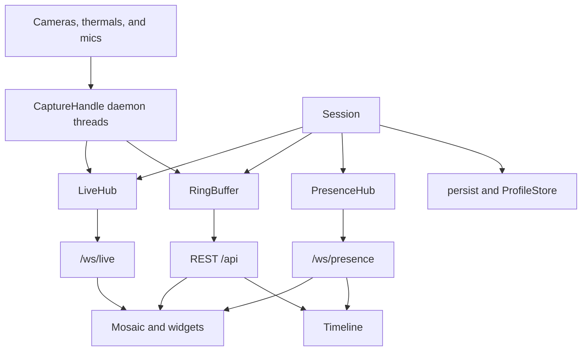

# measync architecture

This document is the source of truth for how measync is shaped. New code must fit these boundaries, invariants, and widget families. If a change would violate them, update this document in the same change.

measync (“measure · align · rewind”) is a lab workbench: tiled live sources, a shared in-RAM capture ring, and a timeline every viewer can scrub independently.

## Purpose

One backend process owns hardware and the capture buffer. Connected browsers are viewers of that single session: they share layout and recording state, but each has its own timeline window.

The product is not a general video editor, a multi-room service, or a per-user store. There is one session, one time base, and no authentication.

## Features

- **Tiled mosaic** — binary-split layout; split, swap, dock, and resize panes. Layout is shared with every connected viewer.
- **Live sources** — cameras, Infiray thermal cameras, and microphones today; other real-time and graph sources later.
- **Live preview** — WebSocket fan-out of the latest sample per source.
- **Record / Stop** — append into a capped RAM ring. Starting a recording clears the ring.
- **Time-aligned eviction** — when the byte cap is exceeded, the oldest horizon is dropped from every track together.
- **Independent timeline** — live by default; click to scrub, scroll to zoom. Each viewer’s window is their own.
- **Captures** — save the ring to `data/captures/` or open a previous take back into RAM.
- **Profiles** — save/load this workspace’s tile layout and sources to `data/profiles/`.
- **Presence** — display names, colors, viewport markers on the shared timeline; click a name to jump to that window.

Unsaved RAM captures are discarded when you Record again or stop the backend.

## Widget families

Tiles are not camera/audio-specific. Every widget belongs to **exactly one** of two families. New source types extend one of these; do not invent a third playback model.

### Real-time

Discrete snapshots along the timeline. Examples: cameras and Infiray thermals today; text logs later.

| Mode | Behavior |
|------|----------|
| Live (no capture under the playhead) | Stream the latest snapshot (`/ws/live/{source_id}`). |
| Scrub / playback | Show the **closest snapshot** to the selected timestamp (timeline window centre). |

Current implementation: [`frontend/src/widgets/CameraWidget.tsx`](../frontend/src/widgets/CameraWidget.tsx) with `GET /api/session/camera/{id}/frame?t=`, and [`frontend/src/widgets/ThermalWidget.tsx`](../frontend/src/widgets/ThermalWidget.tsx) with `GET /api/session/thermal/{id}/frame?t=` (closest snapshot; live `/ws/live` payload is a `THRM` header plus JPEG).

### Graph

Continuous series over a window. Examples: audio envelope today; current/voltage traces later.

| Mode | Behavior |
|------|----------|
| Live (no capture under the playhead) | Stream a rolling preview (`/ws/live/{source_id}`). |
| Scrub / playback | Render the **currently selected window**, centered on the selected timestamp (`t0`–`t1`). |

Current implementation: [`frontend/src/widgets/AudioWidget.tsx`](../frontend/src/widgets/AudioWidget.tsx) with `GET /api/session/audio/{id}/waveform?t0=&t1=` (display) and PCM for playback.

Widgets switch to HTTP ring queries whenever the viewer is scrubbing, playing, or has capture data under the playhead (`followStream = live && !playing && !hasCapture`).

## Runtime topology

```
Browser (Vite :5173)
  /api  ──proxy──► FastAPI (uvicorn :8000)
  /ws   ──proxy──► FastAPI WebSockets
                     │
                     ▼
              data/captures/
              data/profiles/
```

- Backend: Python 3.11+, FastAPI, one global `Session` created in app lifespan.
- Frontend: React 19, TypeScript, Vite 8. Dev server proxies `/api` and `/ws` to `127.0.0.1:8000`.
- Capture is Linux-centric: V4L2 cameras (`/dev/video*`), Infiray-family thermal UVC (256×384 YUYV), and PortAudio mics.
- Persistence lives under repo-root `data/` (gitignored). Path is `backend/measync/main.py` → two parents up → `data/`.

There is no production static serving, TLS, Docker, or multi-process session.

## Components



| Piece | Role |
|-------|------|
| [`backend/measync/main.py`](../backend/measync/main.py) | FastAPI app, CORS, all HTTP and WebSocket routes. No capture or ring logic. |
| [`backend/measync/session.py`](../backend/measync/session.py) | Orchestrator: recording flag, `dirty`, source handles, data dirs. |
| [`backend/measync/capture.py`](../backend/measync/capture.py) | Per-source daemon thread. Always publishes live; appends to the ring only while `recording`. |
| [`backend/measync/ring.py`](../backend/measync/ring.py) | `CamTrack` / `AudioTrack` / `RingBuffer`. Thread-locked; global time-aligned eviction. `CamTrack` holds camera JPEGs and thermal `THRM` snapshots (`kind` on the track). |
| [`backend/measync/livehub.py`](../backend/measync/livehub.py) | Thread → asyncio fan-out. Per-source queues (`maxsize` 2); drop oldest on overflow. |
| [`backend/measync/presence.py`](../backend/measync/presence.py) | Peers, viewport broadcast, shared layout (last writer wins). |
| [`backend/measync/devices.py`](../backend/measync/devices.py) | Enumerate cameras, Infiray thermals, and mics. |
| [`backend/measync/thermal.py`](../backend/measync/thermal.py) | Infiray P2 Pro decode, colormap JPEG, snapshot packing. |
| [`backend/measync/persist.py`](../backend/measync/persist.py) | Capture save/load under `data/captures/`. |
| [`backend/measync/profiles.py`](../backend/measync/profiles.py) | Profile CRUD; `safe_name()` sanitization. |
| [`backend/measync/models.py`](../backend/measync/models.py) | Pydantic request/response schemas. |
| [`frontend/src/App.tsx`](../frontend/src/App.tsx) | Session poll, presence socket, recording/playback, layout sync. |
| [`frontend/src/layout.ts`](../frontend/src/layout.ts) | Binary tree ops: split, remove, swap, dock, resize (ratio 0.15–0.85). |
| [`frontend/src/components/Mosaic.tsx`](../frontend/src/components/Mosaic.tsx) | Recursive tiles; drag-drop relocate; widget host. |
| [`frontend/src/components/Timeline.tsx`](../frontend/src/components/Timeline.tsx) | Scrub, zoom, peer markers, follow-peer. |
| [`frontend/src/types.ts`](../frontend/src/types.ts) / [`frontend/src/api.ts`](../frontend/src/api.ts) | Shared types and REST/WS helpers. Must stay aligned with backend models. |

## Data flows

### Live and record

1. Add a source → capture thread starts.
2. Every sample is published to `LiveHub` (live tiles).
3. **Record** clears the ring, sets `recording=true`, then appends samples and marks `dirty`.
4. **Stop** leaves the ring in RAM (`recording=false`).
5. **Record** again clears unsaved RAM.
6. Save capture → disk; `dirty=false`. Cannot save or open while recording (HTTP 409).

### Scrub and playback

Timestamps are `time.monotonic_ns()` integers, shared across tracks.

- Real-time widgets query a single timestamp (`t` = window centre) and display the nearest snapshot.
- Graph widgets query `[t0, t1]` for the visible window (centred on the selected timestamp).
- Audio playback fetches raw float32 PCM chunks over HTTP (`X-Sample-Rate` header).

### Presence and layout

Clients connect to `/ws/presence`, send `hello` with a display name, then:

- `viewport` about every 80 ms (live / playing / centre / duration).
- `layout` (debounced ~40 ms) with the mosaic tree and tile specs.

The server broadcasts peer lists and layout. The sender is excluded from layout echo (`origin`). A new joiner receives current `layout` + `tiles` in the `hello` reply.

### Persistence

- Captures: `{name}/session.json` plus per-source folders (`camera_0`, `thermal_2`, `audio_1`, …) with numpy timestamps and binary payloads.
- Profiles: JSON under `data/profiles/`. Names are sanitized (`safe_name`: alphanumeric, `.`, `_`, `-`).
- Opened captures become ring tracks with `live: false`; tiles show saved data without reopening the device.

## Invariants

Agents must not break these. If a feature needs to, change this document in the same PR/commit and say why.

1. **One session** — one backend process, one `Session`, one ring, shared by all clients.
2. **One time base** — monotonic nanoseconds (`int`). No wall clock in the ring or timeline queries.
3. **Time-aligned eviction** — the cap is global bytes; dropping data uses the same oldest horizon on every track. No per-track eviction.
4. **Record clears the ring** — start recording wipes RAM. Warn if `dirty`.
5. **No save/open while recording**.
6. **Source IDs today** are `camera:<index>`, `thermal:<index>`, or `audio:<index>`. New kinds should stay `{kind}:{index}` and be validated at the API boundary.
7. **Widget family** — every new widget is real-time (closest snapshot) or graph (selected window). No third scrub model.
8. **Live always streams; ring only while recording** — capture threads publish regardless of `recording`.
9. **`main.py` is I/O only** — routes call `Session` / ring / persist / presence. Capture and eviction stay out of the router.
10. **Capture on daemon threads; asyncio for WebSockets** — `LiveHub.publish` uses `call_soon_threadsafe`. Do not block the event loop on device I/O.
11. **Shared layout last-write-wins** — stored on `PresenceHub`; no CRDT.
12. **No auth** — CORS `allow_origins=["*"]`. Do not assume user isolation or secrets in the API.
13. **Backend types and frontend types stay aligned** — [`models.py`](../backend/measync/models.py) and [`types.ts`](../frontend/src/types.ts).
14. **Layout math lives in `layout.ts`** — mosaic rendering should not grow a second tree model.

## HTTP API

| Method | Path | Purpose |
|--------|------|---------|
| GET | `/api/health` | `{ ok: true }` |
| GET | `/api/devices` | Cameras, Infiray thermals, and mics (busy video devices still listed) |
| GET | `/api/session` | Recording, `t_min`/`t_max`, RAM used/cap, `dirty`, sources |
| PUT | `/api/session/cap` | Set `bytes_cap` (1 MB–64 GB) |
| POST | `/api/session/start` | Clear ring, start recording |
| POST | `/api/session/stop` | Stop recording; keep ring |
| POST | `/api/sources/{source_id}` | Start capture thread |
| DELETE | `/api/sources/{source_id}` | Stop capture, drop live hub |
| GET | `/api/session/camera/{source_id}/frame?t=` | Nearest JPEG at timestamp (ns) |
| GET | `/api/session/thermal/{source_id}/frame?t=` | Nearest thermal snapshot (`THRM` + JPEG) |
| GET | `/api/session/audio/{source_id}/pcm?t0=&t1=` | Raw float32 PCM + `X-Sample-Rate` |
| GET | `/api/session/audio/{source_id}/waveform?t0=&t1=` | Downsampled min/max envelope |
| GET/POST/DELETE | `/api/profiles`, `/api/profiles/{name}` | List, save, load, delete |
| GET/POST | `/api/captures`, `/api/captures/{name}/open` | List, save, open |

New ring query endpoints for future widgets should follow the same split: a point query for real-time snapshots, a range query for graph windows.

## WebSocket protocol

### `/ws/live/{source_id}`

One connection per live tile.

- Real-time camera today: **binary** JPEG frames.
- Real-time thermal today: **binary** `THRM` header (`min`, `max`, `center` °C as little-endian float32, then hottest/coldest pixel `x,y` as uint16) followed by a colormap JPEG.
- Graph audio today: **JSON** `{ t_ns, min, max, sample_rate }` per ~40 ms block.

New live payloads should stay self-describing per source kind. Queues keep only the latest few samples (backpressure by dropping oldest).

### `/ws/presence`

Client → server:

```json
{ "type": "hello", "name": "..." }
{ "type": "viewport", "live": true, "center": 123, "duration": 2000000000, "playing": false }
{ "type": "layout", "layout": {}, "tiles": {} }
```

Server → client:

```json
{ "type": "hello", "you": {}, "peers": [], "layout": null, "tiles": {} }
{ "type": "peers", "peers": [] }
{ "type": "layout", "origin": "user-2", "layout": {}, "tiles": {} }
```

`Peer`: `id`, `name`, `color`, `live`, `playing`, `center`, `duration`. Display name is stored in the browser as `measync.displayName`.

## Constraints for future work

Keep:

- Single-process session and monotonic-ns ring.
- Daemon-thread capture, asyncio WebSockets.
- Time-aligned global eviction.
- Real-time vs graph widget contract.
- Types mirrored across Python and TypeScript.

Do not:

- Add a second session, room, or time base.
- Evict tracks independently.
- Serve a third widget playback model (for example “fit entire take” or “page of log lines” that ignores window centre).
- Put device I/O or ring mutation in `main.py`.
- Assume auth, multi-tenant isolation, or durable RAM across backend restart.

Tests today: `python -m measync.selftest` (ring eviction alignment, frame/waveform, thermal decode, persist round-trip). There is no pytest suite; extend `selftest.py` or add tests when changing ring/persist behavior.

## Module map

```
backend/measync/     FastAPI package
frontend/src/         React UI
  components/         Mosaic, timeline, menus
  widgets/            Real-time and graph tiles
data/                 Runtime captures and profiles (not in git)
```
